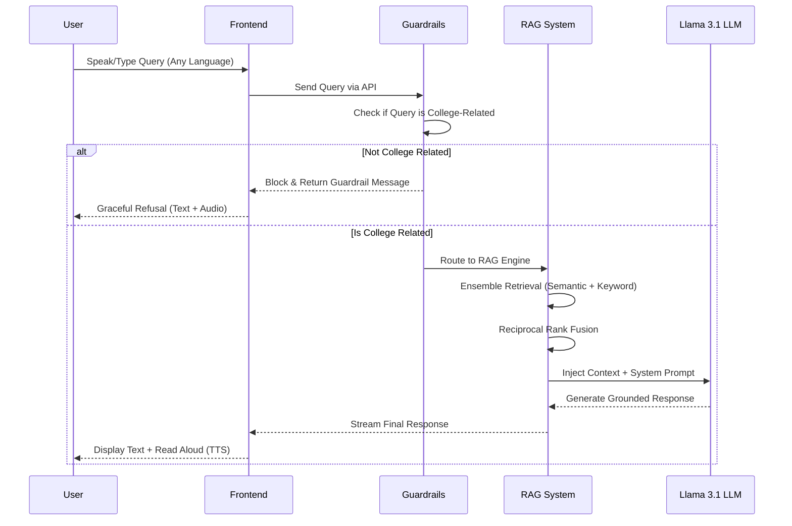
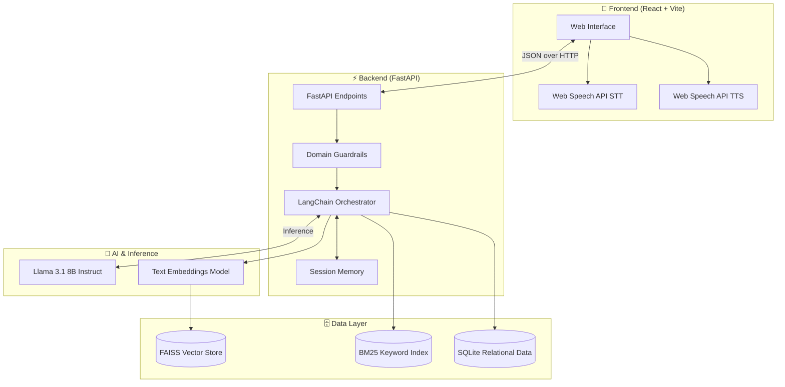

<div align="center">
  
  
  # GNDEC Tech Support Agent
  **Intelligent, Multilingual, Voice-Enabled RAG Chatbot for Guru Nanak Dev Engineering College**

  [](https://reactjs.org/)
  [](https://vitejs.dev/)
  [](https://fastapi.tiangolo.com/)
  [](https://ai.meta.com/llama/)
  [](https://langchain.com/)
  [](https://sqlite.org/)

  > A highly accurate, AI-powered digital assistant transforming how students, faculty, and applicants interact with Guru Nanak Dev Engineering College data.
</div>

## Live Link

[Click here to access the live agent](https://dealing-price-announces-circular.trycloudflare.com)

---

## 🚀 Overview

The **GNDEC Tech Support Agent** is a state-of-the-art Retrieval-Augmented Generation (RAG) system built with an **Agentic AI architecture**. It deeply understands college syllabi, fee structures, faculty details, and admission processes, seamlessly retrieving and presenting accurate information across multiple languages.

## ✨ Key Features

- 🧠 **Agentic RAG Engine**: Utilizes an Ensemble Retriever combining **FAISS (Semantic)** and **BM25 (Keyword)** with Reciprocal Rank Fusion (RRF) for pinpoint accuracy in retrieving college documents.
- 🗣️ **Multilingual Mastery**: Native, flawless support for **English, Hindi, Punjabi (Gurmukhi & Roman script), and Hinglish**. The LLM perfectly adapts to the user's spoken language.
- 🎙️ **Voice-Enabled (Zero Cost)**: 
  - **Speech-to-Text**: Dictate queries in Punjabi or Hindi effortlessly using the native Web Speech API.
  - **Text-to-Speech**: The AI reads its responses aloud using a dynamically selected, high-quality Indian accent voice.
- 🛡️ **Ironclad Guardrails**: Engineered with zero-tolerance anti-hallucination guardrails to reject non-college queries, ensuring absolute professionalism.

---

## ⚙️ How It Works (Process Flow)

The interaction process is built for speed, safety, and accuracy.



---

## 🏗️ System Architecture & Tech Flow

The system features a decoupled architecture separating the user-facing interface from heavy AI inference tasks.



---

## 🛠️ Local Setup & Installation

### 1. Backend Setup

```bash
# Clone the repository
git clone https://github.com/sharnjeet21/gndec_chat_support.git
cd gndec_chat_support

# Create and activate virtual environment
python -m venv .venv
source .venv/bin/activate  # On Windows: .venv\Scripts\activate

# Install dependencies
pip install -r requirements.txt

# Start the FastAPI server
uvicorn backend.app:app --host 0.0.0.0 --port 8000 --reload
```

### 2. Frontend Setup

Open a new terminal window:

```bash
cd support_ui

# Install Node dependencies
npm install

# Start the Vite development server
npm run dev
```

### 3. Environment Variables
Create a `.env` file in the root directory:
```env
MODEL_PROVIDER=OLLAMA
LLM_MODEL=llama3.1
OPENAI_API_KEY=your_key_here  # Only required if using a cloud LLM provider
```

---

## 🔒 Security & Safety

1. **Strict Domain Locking**: The bot gracefully refuses questions about politics, coding, general knowledge, or anything unrelated to GNDEC.
2. **Repetition Collapse Protection**: The LLM configuration is hardened with `presence_penalty` and `frequency_penalty` constraints to prevent hallucination loops (especially when users mix Roman script with regional languages).
3. **Rate Limits**: Configured to ensure sustainable hardware usage during traffic spikes.

---

<div align="center">
  <i>Built with ❤️ for Guru Nanak Dev Engineering College</i>
</div>
