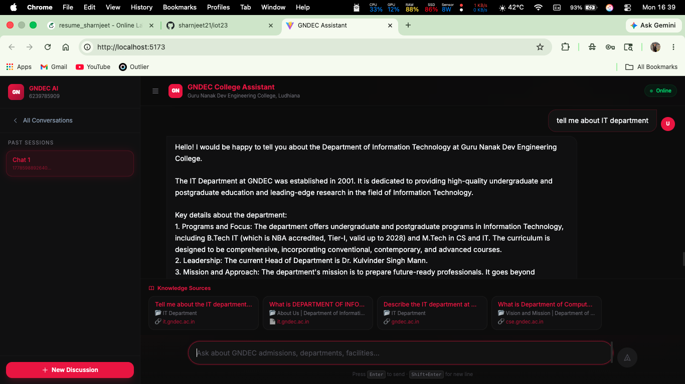

# GNDEC AI Assistant

An intelligent RAG-powered chatbot for **Guru Nanak Dev Engineering College (GNDEC), Ludhiana**. Provides instant, accurate answers about admissions, departments, fees, facilities, and college life using AI-driven knowledge retrieval.

---

## UI Showcase



---

## Features

- **Instant Answers** — Get information about admissions, programs, fees, and facilities without browsing the website
- **AI-Powered** — Uses RAG (Retrieval-Augmented Generation) with local LLM for accurate responses
- **Real-time Streaming** — Token-by-token response generation for smooth user experience
- **Conversation Memory** — Maintains chat history and context across sessions
- **Source Attribution** — References verified sources for each answer
- **Scope Control** — Rejects out-of-domain questions, focuses only on college-related queries

---

## Tech Stack

| Component | Technology |
|---|---|
| Frontend | React 19, Vite, Tailwind CSS |
| Backend | FastAPI, Python 3.12 |
| LLM | Ollama (llama3.2:3b) |
| Embeddings | Sentence Transformers (all-MiniLM-L6-v2) |
| Vector DB | FAISS (IndexFlatL2) |
| Memory | Redis |
| Database | PostgreSQL |

---

## Architecture

```
User Interface (React)
        ↓
FastAPI Backend (Port 8080)
        ↓
    ┌───┴────────────────┐
    ↓                    ↓
FAISS Vector DB    Ollama LLM
(4,921 Q&A pairs)  (llama3.2:3b)
    ↓                    ↓
    └────────┬───────────┘
             ↓
    PostgreSQL + Redis
    (History & Memory)
```

---

## Quick Start

### Prerequisites
- Python 3.12+
- Node.js 18+
- PostgreSQL 14+
- Redis
- [Ollama](https://ollama.com) with `llama3.2:3b`

### Setup

1. **Install dependencies**
```bash
pip install -r requirements.txt
cd support_ui && npm install && cd ..
```

2. **Configure database**
```bash
psql postgres -c "CREATE USER gndec_user WITH PASSWORD 'gndec_pass';"
psql postgres -c "CREATE DATABASE gndec_ai OWNER gndec_user;"
psql gndec_ai < schema.sql
```

3. **Set environment variables**
```bash
cp .env.bak .env
# Edit .env with your configuration
```

4. **Build vector database**
```bash
python3 backend/build_vector_db.py
```

5. **Start services**
```bash
# Terminal 1
redis-server

# Terminal 2
ollama serve

# Terminal 3
uvicorn backend.app:app --host 0.0.0.0 --port 8080

# Terminal 4
cd support_ui && npm run dev
```

Open **http://localhost:5173**

---

## Project Structure

```
.
├── backend/
│   ├── app.py              # FastAPI application
│   ├── agent.py            # RAG pipeline & streaming
│   ├── vectorstore.py      # FAISS retrieval
│   ├── domain_guard.py     # Query validation
│   ├── moderation.py       # Content filtering
│   ├── chat_store.py       # Message persistence
│   ├── llm/llm.py          # LLM wrapper
│   └── faiss_store/        # Vector index
│
├── data/
│   ├── gndec_data.json     # Scraped Q&A (4,869 pairs)
│   └── gndec_facts.json    # Curated facts (52 pairs)
│
├── support_ui/             # React frontend
│   └── src/
│       ├── pages/          # Chat, sessions, login
│       └── components/     # UI components
│
└── requirements.txt        # Python dependencies
```

---

## API Endpoints

All endpoints require `X-API-KEY` header.

| Method | Endpoint | Purpose |
|---|---|---|
| GET | `/health` | Health check |
| GET | `/api/ask` | Synchronous response |
| GET | `/api/ask_stream` | Streaming response (SSE) |
| GET | `/api/history` | Chat history |
| GET | `/api/sessions` | List sessions |
| POST | `/api/close_session` | End session |

---

## Knowledge Base

- **Total Q&A Pairs**: 4,921
- **Curated Facts**: 52 high-quality pairs
- **Scraped Data**: 4,869 website Q&A pairs
- **Coverage**: All GNDEC departments and services

---

## Domain Guard

The system validates queries using:
1. **Keyword Filtering** — Rejects obvious out-of-scope questions
2. **FAISS Similarity** — Checks semantic relevance (threshold: 1.3)
3. **Toxicity Check** — Filters harmful content

Out-of-scope queries receive a polite redirect message.

---

## Docker

```bash
docker build -t gndec-assistant .
docker run -p 8080:8080 --env-file .env gndec-assistant
```

Requires external PostgreSQL, Redis, and Ollama services.

---

## About GNDEC

- **Name**: Guru Nanak Dev Engineering College
- **Location**: Gill Road, Ludhiana, Punjab – 141006, India
- **Website**: https://gndec.ac.in
- **Established**: 1956
- **Affiliation**: IKG Punjab Technical University (IKGPTU)
- **Accreditation**: NAAC Grade A, NBA Tier-I, UGC Autonomous
